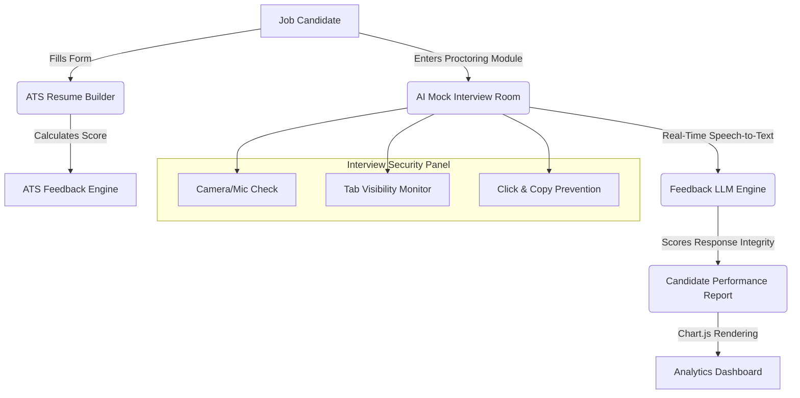

# 💼 HireSense AI — Intelligent Resume Builder & Smart Mock Interview System

[](https://react.dev)
[](https://nodejs.org)
[](https://mongodb.com)
[](https://tailwindcss.com)
[](LICENSE)

A complete full-stack web application designed for analyzing resumes, extracting keywords, and conducting dynamic, proctored mock interviews securely from the browser. 

**Developed by [Sriram Gandhi S](https://sriram.website/)** • **Proprietary Software**

---

## 📋 Table of Contents
- [Overview & Workflow](#-overview--workflow)
- [Key Features](#-key-features)
- [Tech Stack](#-tech-stack)
- [Project Directory Structure](#-project-directory-structure)
- [Installation & Setup](#-installation--setup)
- [License & Intellectual Property](#-license--intellectual-property)

---

## 🏗️ Overview & Workflow



---

## ✨ Key Features

### 1. **ATS-Optimized Resume Builder**
*   Multi-step form interface allowing users to dynamically build and refine resume metrics.
*   **ATS Scoring Engine**: Analyzes key credentials and calculates keyword optimization match percentages.
*   **PDF Compiler**: Instant local download of formatted resume PDFs.

### 2. **Smart Mock Interview Room**
*   **Interactive Chat Mode**: Switch between Auto and Manual modes to customize question flows.
*   **Speech-to-Text Engine**: Integrates Web Speech API for high-speed local audio transcription directly in the browser.
*   **Contextual Logic**: Follow-up questions are dynamically generated based on previous responses.

### 3. **AI-Powered Proctoring Engine**
*   **Tab Switch Detection**: Monitors Candidate focus in real-time utilizing the Page Visibility API.
*   **Input Protection**: Disables copy, paste, and right-click behaviors to ensure exam integrity.
*   **Biometric Feed**: Mounts local camera stream to record candidacy status during mock reviews.

### 4. **Candidate Analytics Dashboard**
*   Visualizes test metrics using custom-rendered **Chart.js** canvases.
*   Grades applicants across multiple signals: Technical capability, Communication delivery, and Exam integrity.
*   Generates a structured 30-day skill development roadmap.

---

## 🛠️ Tech Stack

*   **Frontend**: React.js (Vite), Tailwind CSS, Lucide Icons, Chart.js
*   **Backend**: Node.js, Express.js
*   **Database**: MongoDB (Mongoose ORM)
*   **Security & Auth**: JSON Web Tokens (JWT), bcrypt hashing
*   **APIs Integrated**: OpenAI GPT-4, Web Speech Translation API

---

## 📂 Project Directory Structure

```text
Hiresense/
├── backend/                  # Node.js Express Server
│   ├── controllers/          # Business logic handlers
│   ├── middleware/           # authMiddleware validation
│   ├── models/               # MongoDB models (User, Resume, Interview)
│   ├── routes/               # API endpoints (Auth, Resumes, Interviews, Admin)
│   └── server.js             # Express Server entrypoint
├── frontend/                 # Vite React client app
│   ├── src/
│   │   ├── components/       # Custom shared layout structures
│   │   ├── pages/            # Login, Dashboard, ResumeBuilder, Interview, Admin
│   │   └── services/         # Axios-based API client wrappers
│   └── package.json          # Node configuration
└── README.md                 # Project Documentation
```

---

## 🚀 Installation & Setup

### Database Configuration
Ensure MongoDB is running locally or configure a connection string inside the environment variables:
`mongodb://localhost:27017/hiresense`

### Backend Setup
1. Navigate to the backend directory:
   ```bash
   cd backend
   ```
2. Install dependencies:
   ```bash
   npm install
   ```
3. Copy `.env.example` to `.env` and fill in your details:
   ```env
   PORT=5000
   MONGO_URI=mongodb://localhost:27017/hiresense
   JWT_SECRET=super_secret_hiresense_jwt_token
   OPENAI_API_KEY=your_openai_api_key_here
   ```
4. Start the server:
   ```bash
   npm run dev
   ```

### Frontend Setup
1. Navigate to the frontend directory:
   ```bash
   cd ../frontend
   ```
2. Install dependencies:
   ```bash
   npm install
   ```
3. Start the development server:
   ```bash
   npm run dev
   ```

---

## 📄 License & Intellectual Property

**Proprietary Portfolio Project** — All rights reserved by **Sriram Gandhi S**.

This repository is published exclusively for educational review, architectural assessment, and portfolio evaluation. Unauthorized replication, redistribution, commercialization, or modifications of this source code are strictly prohibited without written consent from the author.

*Developed with 💻 by [Sriram Gandhi S](https://github.com/SriramGandhiS).*
